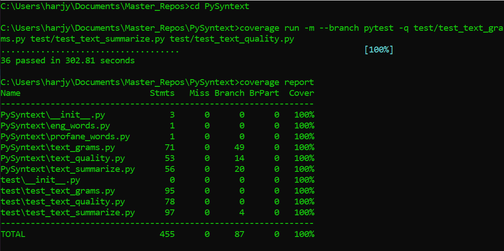

# PySyntext

[](https://travis-ci.org/UBC-MDS/PySyntext)

Text Summarization in Python

### Contributors

| [Harjyot Kaur](https://github.com/HarjyotKaur) | [Alexander Pak](https://github.com/pak-alex) | [Yenan Zhang](https://github.com/YenanZ)|
|:------------:|:--------------:|:--------------:|


## Overview

There are many packages that cover summary statistics for numerical data. However, when it comes to text data, there is a lack of selection for packages offering similar functionality. Our group would like to tackle this problem by creating `PySyntext`. This package will allow users to input passages and receive summary information and quality analysis of the text, giving the user valuable information on how best to proceed with their data.

Sample functionality included in this package for a given text passage:

* Most common word
* Average word length
* Most frequent n-gram
* Toxicity in text
* Number of spelling mistakes
* ...etc.


## Usage Scenario

#### Installation

 * Open command prompt as `administrator` and type the following to download the package.

 `pip install git+https://github.com/UBC-MDS/PySyntext.git`

*Note: To avoid errors download `nltk.download('stopwords')`*


## Functionality and Usage:

#### Function 1: `text_summarize`

`text_summarize` function of class `PySyntext` takes in `string` as an input and produces `DataFrame` as an output containing a quantitative summary of the input. The quantitative summary entails the following:

- Number of Words
- Number of Sentences
- Most Common Word/Words
- Least Common Word/Words
- Average Word Length
- Average Sentence Length

<br>

| Name | Type |
|---|---|
| Input | str |
| Output | DataFrame |

<br>

| Name | Type | Default|
|---|---|---|
| text | str | NA |  
| stop_remove | boolean | False |
| remove_punctuation | boolean | True |
| remove_number |  boolean | True |
| case_sensitive |  boolean | False |

<br>

#### Usage:

```
import PySyntext

text="This is the first sentence in this paragraph. This is the second sentence. This is the third."

PySyntext.text_summarize(text)

```

#### Output


<br>

### Function 2: `text_grams`

`text_grams` function of class `PySyntext` takes in `string` as an input and produces `DataFrame` as an output containing lists of top 5 ngrams. The top `k` ngrams and `n` are user based inputs with default values (k=5 and n=(2,3))

<br>

| Name | Type |
|---|---|
| Input | str |
| Output | DataFrame |


The function takes in the following arguments:

<br>

| Name | Type | Default|
|---|---|---|
| text | str | NA |
| k | int | 5 |
| n | int,list | (2,3) |
| stop_remove | boolean | True |
| remove_punctuation | boolean | True |
| remove_number |  boolean | True |
| case_sensitive |  boolean | False |


<br>

#### Usage:

```
import PySyntext

text="This is the first sentence in this paragraph. This is the second sentence. This is the third."

PySyntext.text_grams(text)

```
#### Output


<br>

### Function 3: `text_quality`

`text_quality` function of class `PySyntext` takes in `string` as an input and produces `DataFrame` as an output a qualitative summary of the input. The qualitative summary would include the following:

- Spelling Mistakes: List of words spelt wrong
- Count of words spelt wrong: Count of words spelt wrong
- Proportion of words spelt wrong: Words spelt wrong /Total words
- Toxic Words: List of Abusive or Slang words used
- Count of toxic words: Count of toxic words
- Proportion of toxic words: Count of toxic words /Total words

<br>

| Name | Type |
|---|---|
| Input | str |
| Output | DataFrame |

<br>

The function takes in the following arguments:

<br>

| Name | Type | Default|
|---|---|---|
| text | str | NA |

<br>

#### Usage:

```
import PySyntext

text="This is the wrng. This is shitty."

PySyntext.text_quality(text)

```
#### Output


<br>

## Test Coverage:




## Dependencies

* pandas
* numpy
* nltk
* nltk('stopwords')
